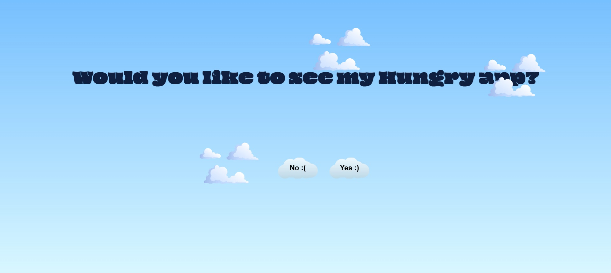
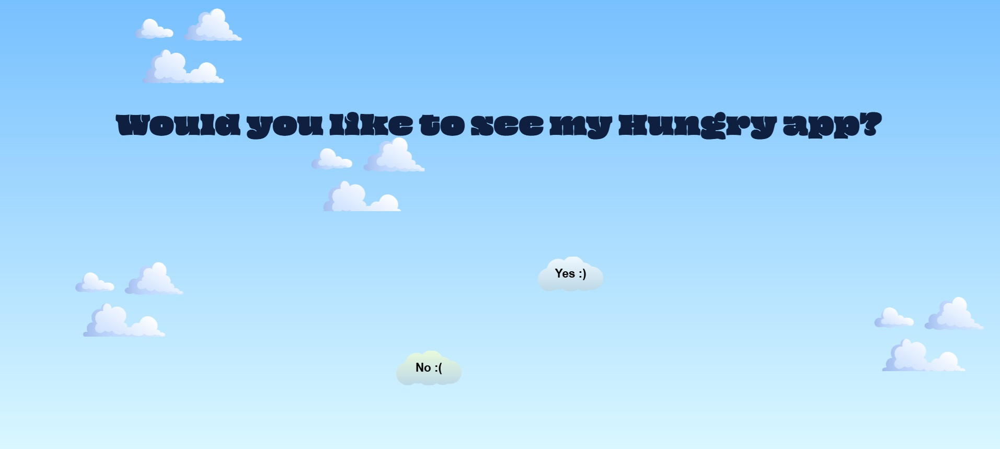
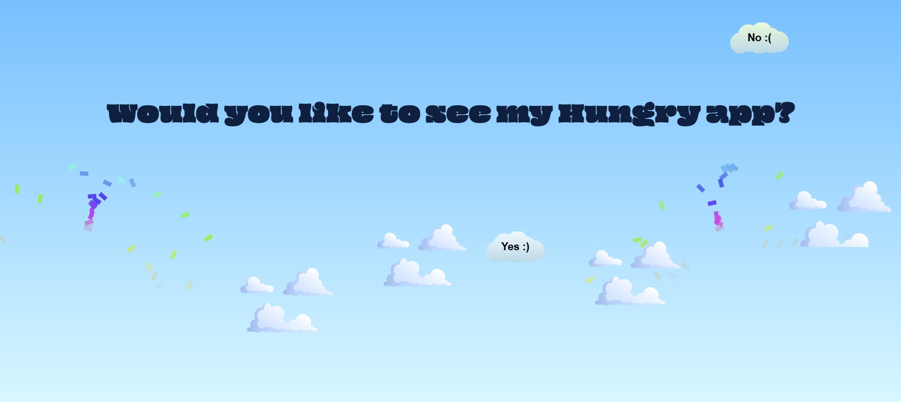

# Click Me

A fun, interactive web app created with Vue.js Composition API. The app features animated clouds, playful buttons, and a surprise confetti effect, with a seamless transition to another app on a successful interaction.

## Main Page

The initial view of the app with animated clouds in the background.

## Page after No button click 

## Page after Yes button click 
